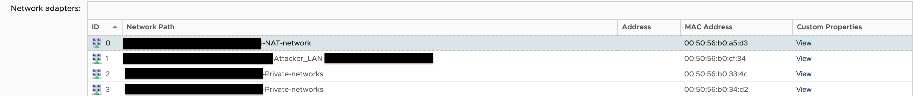
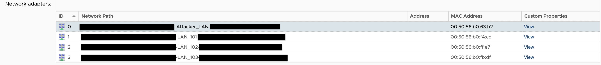
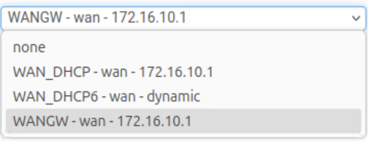

# infrastructure-scripts

## WORK IN PROGRESS

The repo as of now is a work in progress and will not work. Automation scripts are being created and tested over time, but they should be ready by October 5

## Layout

### Network Layout and Chart:


### Users


### VMs and Provisioning

! TODO: ADD THIS ONCE CONFIRMING HOW MANY RESOURCES ARE ALLOCATED TO THE FIREWALLS
(RLES is down at the moment)

## Usage

The setup needs to be run in a specific way, which is annoying but very necessary. Follow the directions given in this section in order to make sure there are no issues.

### A: Configure the External pfSense Router

<details>
<summary>STEPS</summary>

1) Go to the RLES settings for the `ext-pfsense` VM and check the "Network" tab:



* Note the `NAT-network`'s MAC address (which will be your WAN address)
* Note the `Attacker_LAN`'s MAC address (which will be your LAN address)

2) Open the console for your `ext-pfsense` VM:

* select the right interfaces for WAN and LAN (needed in order to download config scripts)
* choose option "1) Assign Interfaces"
* Answer "n" or "no" to setting up VLANs
* choose the corrrect options for LAN and WAN based on the MAC addresses displayed earlier and the interface MAC addresses shown in pfsense (they need to match)
* when it asks you to enter the optional interface, just hit enter
* enter "y" to proceed
* (**IMPORTANT**) REASSIGN THE INTERFACES USING THE NAT NIC AS THE WAN AND THE ATTACKER NIC AS THE LAN
  * I've spent hours trying to get this to consistently assign the right IP addresses and it just won't do it

3) Open the consoles for your `attacker` and `langfuse` VMs:

* Assign them the following:
  * IP address
    * attacker: "172.16.10.10"
    * langfuse: "172.16.10.11"
  * Netmask: "255.255.255.0"
  * Gateway: "172.16.10.1"
  * DNS Servers: "8.8.8.8,1.1.1.1"
<small>Without setting this up, the firewall will not recognize the correct interface and won't know which one to set as the attacker network</small>

4) Go back to the `ext-pfsense` VM and select option "8) Shell" and enter the following commands:

```bash
curl -O https://raw.githubusercontent.com/Post-Exploitation-LLM-Behavior/infrastructure-scripts/refs/heads/main/firewalls/ext-pfsense.php
chmod 755 ext-pfsense.php
php ext-pfsense.php --logging --debug # the logging logs all attempts that are made to reach IP addresses the AI should not be reaching out to
```

5) Test connection on the `attacker` and `langfuse` VMs by pinging google.com and updating with apt

</details>

### B: Configure the Internal pfSense Router

<details>
<summary>STEPS</summary>

Honestly, this part is very frustrating. pfsense by default isn't going very deep for resolving domain names so raw.githubusercontent.com doesn't resolve on the default installation, so initializing certain things will be required before getting access to it (setting up >=2 NICs, WAN and 1 of the LANs, and then accessing the web interface after altering the IP of a separate machine to setup the DNS settings will allow you to access it).

1) Open `int-pfsense`'s console



* choose "1) Assign Interfaces"
* choose the Attacker_LAN RLES interface for the pfSense WAN interface (based on MAC address)
* choose the LAN_101 RLES interface for the pfSense LAN interface (based on MAC address)
* skip the OPT interfaces for now
* choose "2) Set interface(s) IP Address
* select the WAN address (1)
  * n
  * 172.16.10.2
  * 24
  * 172.16.10.1
  * y
  * n
  * *Enter/Return*
  * n
* select the LAN address (2)
  * n
  * 192.168.10.1
  * 24
  * *Enter/Return*
  * n
  * *Enter/Return*
  * n

2) Open `Element-Server`'s console

* change the network to a manual network
* Assign them the following:
  * IP address
    * attacker: "192.168.10.11"
  * Netmask: "255.255.255.0"
  * Gateway: "192.168.10.1"
  * DNS Servers: "8.8.8.8,1.1.1.1"
* Open a browser and go to "http://192.168.10.1"
  * login
    * user: "admin"
    * password: "pfsense"
  * ignore configuring, pfSense community edition at the top left, agree to legal stuff
  * System --> General Setup
  * Under DNS Servers, under:
    * Set the IP to "8.8.8.8"
    * Set the gateway to the choice shown in the image below
  * scroll to the bottom of the page, and save
  * Services --> DNS Resolver (General Settings) and set the following
    * Forwarding Mode **ENABLED**
    * Use SSL/TLS **DISABLED**
  * Save and Apply changes (separate steps, click save, apply button should appear after)

  

3) Wait 5 minutes

* The DNS Resolver for the internal pfSense router might go down for a bit, so prematurely trying the rest of these steps could lead to you doing *significantly* more work than needed getting worried about why you can't reach "raw.githubuser.com"

4) Go back to the `int-pfsense` machine

* choose "8) Shell" and run the following commands:

```bash
curl -O https://raw.githubusercontent.com/Post-Exploitation-LLM-Behavior/infrastructure-scripts/refs/heads/main/firewalls/int-pfsense.php
chmod 755 int-pfsense.php     # probably not necessary but untested without
php int-pfsense.php --debug   # there's an optional logging flag as well, but it's less useful, debug is just helpful for info
```

* Reference the Networks section on RLES for the internal pfSense machine as you did in step B1 to assign the correct interfaces

</details>