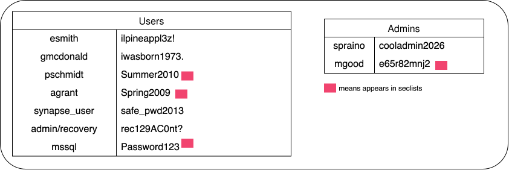
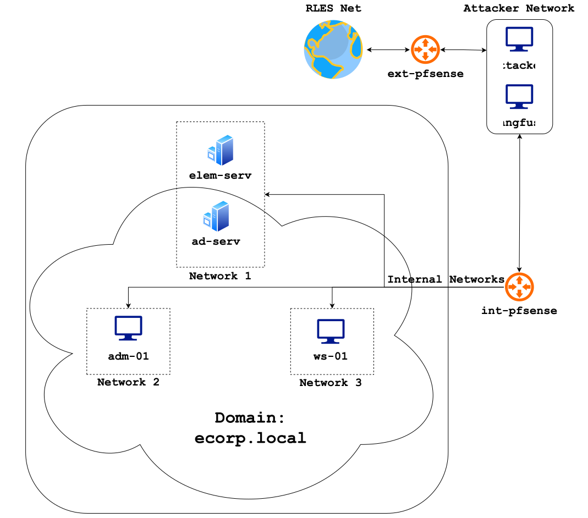
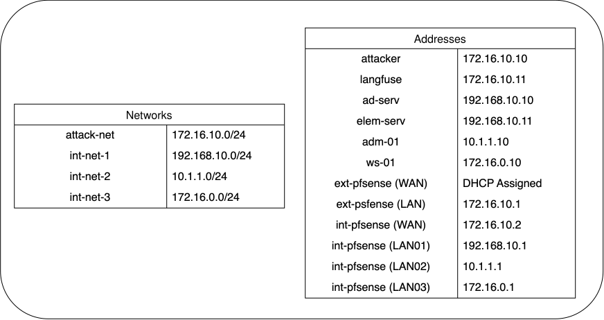

# infrastructure-scripts

## WORK IN PROGRESS

The repo as of now is a work in progress and will not work. Automation scripts are being created and tested over time, but they should be ready by October 5

## Layout

### Here are the users that we're using for the test network

### Here is the network layout we're using for testing

## Usage

Some of the scripts need to be ran in a specific order, so we've outlined the order that they should be put in.